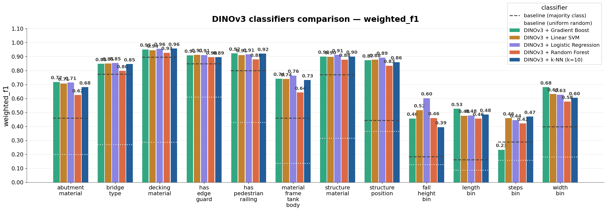
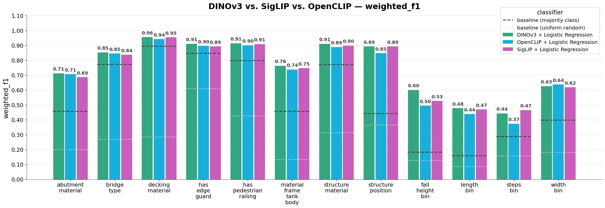

```{python}
#| include: false
import pandas as pd

master_df = pd.read_csv("../data/processed/master_dataset.csv")
file_exists = master_df["file_exists"]
if file_exists.dtype == object:
    image_file_count = int(
        file_exists.astype(str).str.lower().isin(["true", "1", "yes"]).sum()
    )
else:
    image_file_count = int(file_exists.fillna(False).sum())

images_per_asset = master_df.groupby("asset_id")["image_path"].nunique()
data_summary = pd.DataFrame(
    {
        "Measure": [
            "Image-asset rows",
            "Unique assets",
            "Rows with local image files",
            "Assets with more than one image",
            "Mean images per asset",
            "Median images per asset",
            "Maximum images for one asset",
        ],
        "Value": [
            f"{len(master_df):,}",
            f"{master_df['asset_id'].nunique():,}",
            f"{image_file_count:,}",
            f"{int((images_per_asset > 1).sum()):,} ({(images_per_asset > 1).mean():.1%})",
            f"{images_per_asset.mean():.2f}",
            f"{images_per_asset.median():.0f}",
            f"{images_per_asset.max():.0f}",
        ],
    }
)
asset_category_counts = (
    master_df["profile_name"]
    .value_counts()
    .rename_axis("Asset category")
    .reset_index(name="Image-asset rows")
)
asset_category_counts["Image-asset rows"] = asset_category_counts["Image-asset rows"].map(
    lambda value: f"{value:,}"
)

# --- Derived values for inline references in the prose ---
multi_image_assets = int((images_per_asset > 1).sum())
multi_image_share = (images_per_asset > 1).mean()
mean_images = images_per_asset.mean()
median_images = images_per_asset.median()
max_images = int(images_per_asset.max())

fall_height_fill = master_df["fall_height_bin"].notna().mean()
steps_fill = master_df["steps_bin"].notna().mean()
```

# Executive summary

[to be completed after running pipeline with test set + obtaining results]


# Introduction

BC Parks manages over 100,000 infrastructure records across provincial parks, including assets such as stairs, trail bridges, boardwalks, viewing platforms, campsites, and picnic facilities [@parry2026proposal]. Accurate information about these assets is essential for maintenance planning, replacement cost estimation, safety inspections, and long-term asset management. Infrastructure characteristics such as material type, dimensions, and structural features are used to determine maintenance requirements and whether an asset requires inspection by a qualified professional. However, many records in the BC Parks asset inventory contain incomplete attribute information, limiting the ability of staff to confidently use the database for operational planning and decision-making.

To maintain this inventory, field inspectors collect photos and record asset characteristics during site visits. As a result, BC Parks has accumulated a large repository of infrastructure images, with approximately 50,000 asset records containing one or more photographs [@parry2026proposal]. While these images capture valuable visual information about asset characteristics, many records still contain missing attributes due to incomplete field measurements, inconsistent data collection practices, or historical gaps in the inventory. Manually reviewing and labeling tens of thousands of images would require substantial staff time and is not feasible at scale. Consequently, incomplete records persist, limiting its value as a decision-support tool.

Recent advances in computer vision and vision-language models (VLMs) have demonstrated strong capabilities for extracting structured information from images, creating an opportunity to enrich infrastructure records using existing image-based data [@volkov2025imagerecognitionvisionlanguage]. In collaboration with BC Parks, the broad objective of applying image analysis to infrastructure photographs was refined into three specific goals: (1) automate the prediction of missing asset attributes from photographs, (2) provide a confidence score for every prediction so that uncertain predictions can be flagged for manual review, and (3) develop a modular workflow that can be extended to additional asset categories in the future, such as picnic tables, campsites, and tent pads. Together, these objectives aim to improve the completeness and reliability of the BC Parks asset inventory while minimizing the need for manual data entry and review.

The dataset for this project contains images and attribute values for assets in `{python} f"{master_df['profile_name'].nunique()}"` infrastructure categories: stairs, trail bridges, low boardwalks, elevated boardwalks, and viewing platforms. Exploratory data analysis revealed several challenges, such as attribute class imbalances and inconsistent image quality and framing. To address these challenges, we developed a reproducible machine learning pipeline that generates structured asset attribute predictions from one or more photographs. Images first pass through a privacy-screening stage, where personally identifiable information (PII), such as faces, is detected and blurred. The cleaned images are then transformed into numerical image embeddings and passed to a collection of lightweight, attribute-specific classifiers. In addition to the primary embedding-based approach, the pipeline supports optional attribute prediction using open-source vision-language models (VLMs) accessed through external APIs. The resulting predictions are combined with confidence scores and exported in a structured format that can be integrated into existing asset management workflows.

Across the evaluated asset categories, the pipeline achieved strong performance on structural attributes such as bridge type, decking material, and pedestrian railing presence, with a mean weighted F1-score of 0.88. Performance was lower for measurement-related attributes such as length, width, number of steps, and fall height, which achieved a mean weighted F1-score of 0.62. These results demonstrate the potential for image-based machine learning to improve the completeness and usability of BC Parks' infrastructure inventory while providing a scalable foundation for future expansion to additional asset types.

This report describes the development and evaluation of the proposed image-analysis pipeline. We first present the dataset and key findings from the exploratory data analysis, followed by the modelling approaches investigated, including both vision-language models and embedding-based classifiers. We then describe the final data product delivered to BC Parks, evaluate its performance and conclude with recommendations for deployment and future improvements.


# Data and exploratory data analysis (EDA)

## Data sources and collection

BC Parks provided infrastructure asset records and attached image metadata from
the CityWide asset management system. The export covers the asset families explored
during this project: trail bridges, stairs, boardwalks, and viewing
platforms. The raw data contains three linked components:

- Asset records: including asset identifier and asset category
- Asset attribute records: including materials, structural features, and measurements recorded by field staff
- Image attachment records and downloaded image files

The working dataset is organized around an image-asset attachment row. Each row contains an `asset_id`, image path, CityWide profile, file metadata, and the available attribute values for that asset. For modelling, however, the asset is the prediction unit: multiple images linked to the same asset are grouped together so one asset does not appear in both training and validation folds.

## Size and characteristics

The final processed master dataset contains `{python} f"{len(master_df):,}"` image-asset rows linked to `{python} f"{master_df['asset_id'].nunique():,}"` unique assets. Of these rows, `{python} f"{image_file_count:,}"` have corresponding local image files. The image coverage is uneven by asset type, with most rows belonging to boardwalks (lower than 1.2 meters) and trail bridges.

```{python}
#| label: tbl-data-summary
#| echo: false
#| tbl-cap: "Reproducible summary counts from `data/processed/master_dataset.csv`."
data_summary
```

```{python}
#| label: tbl-asset-category-counts
#| echo: false
#| tbl-cap: "Image-asset rows by CityWide asset category."
asset_category_counts
```

Most assets have a single image, but `{python} f"{multi_image_assets:,}"` assets, or `{python} f"{multi_image_share:.1%}"` of assets, have more than one image. The mean number of images per asset is `{python} f"{mean_images:.2f}"`, the median is `{python} f"{median_images:.0f}"`, and the largest asset has `{python} f"{max_images}"` images. This is useful because multiple viewpoints can reveal different details, but it also makes grouped evaluation essential.

## Exploratory findings

The EDA showed that the project is primarily a missing-attribute prediction problem rather than a clean image classification problem. Attribute coverage varies sharply by field. Relatively common labels include pedestrian railing presence, decking material, width, structure material, length, and edge guard presence. Other targets are much sparser: fall height is available for only about `{python} f"{fall_height_fill:.1%}"` of rows, and number of steps is available for about `{python} f"{steps_fill:.1%}"` of rows.

{#fig-attribute-fill-rate width=90%}

The categorical targets are also imbalanced. Several material fields are dominated by timber, and binary structural fields are often dominated by one class. Because of this imbalance, model evaluation cannot rely on accuracy alone; the primary evaluation metric (weighted F1) is discussed in the Methods section.

{#fig-categorical-distributions width=90%}

The numerical fields are not treated as exact measurement regression targets in the final pipeline. Image-only prediction does not provide a stable scale reference, and the original measurements are sparse and irregular. We therefore bin length, width, fall height, and number of steps into ordered categories
before modelling.

{#fig-numeric-distributions width=90%}

## Data quality, limitations, and preprocessing

The EDA identified several practical data issues that shaped the final pipeline:

- Missing labels are common, and some fields use placeholder values such as `TBD`; these are treated as unavailable labels during modelling.
- Some assets have several photos while others have only one, so train and validation splits are grouped by `asset_id` to prevent leakage.
- Image quality is inconsistent. Some photos are close-ups, poorly framed, or focused on only part of the structure, which can make visual attributes impossible to determine from the available image.
- Not every attachment row has a usable local image file, so the pipeline checks image availability before feature extraction via embeddings or VLM model inference.
- Because photos may contain people or vehicles, a YOLO model screens out these images and applies blurring around individuals before passing to any cloud VLM workflows. Flagged images are blurred or excluded from the cleaned upload set.

The processed training files in `data/processed/train/` are attribute-specific datasets derived from the master table. Each file keeps the relevant assets, image paths, and target label for one prediction task. For DINOv3 and related embedding models, image-level embeddings are averaged to one feature vector per asset. This keeps the output aligned with the partner use case: one row of predicted attributes per infrastructure asset, with confidence values where the
model can provide them.

# Data science methods

## Approaches considered

To address BCPark's main objective, automating attribute labelling and filing in missing attribute labels where possible, we started with a simple no-training-required approach, using zero-shot vision language models. This was motivated by our limited labelled data, especially across complex attributes like length, width, fall height and number of steps, which are difficult to extract from images without a scale or size reference. After assessing this method, we also wanted to see whether fine grained visual details that distinguish material types, could be better captured by embedding models, prompting us to explore different pretrained embedding models, often trained on billions of images, in combination with a simple classifier to label all attributes from images. We anticipated that because embedding models use vector embeddings that can capture similarity from images, that these could potentially outperform the VLM's reasoning when it came to structurally distinct material types, but would likely not differ in the performance on the numerical, measuremeant based attributes. 

We used **weighted F1** as the primary model-selection metric because the attribute labels are highly imbalanced. A metric that only rewards the dominant class would overstate model quality for attributes where one material or one structural category appears much more often than the others. Weighted F1 balances precision and recall while weighting each class by its support, making it a better summary of performance on the distribution of labels BC Parks is most likely to encounter. Macro F1 was retained only as a diagnostic for minority-class behaviour because it gives each class equal weight regardless of frequency.

To ensure we had a comparable benchmark, we implemeneted a majority class 'dummy' baseline classifier, that always predicted the majority category for each attribute, to reflect the nature of the class imbalance in some of our data, a uniform random guessing classifier, that predicted a label at random (from all possible labels) and a non-uniform (stratified) random guesser, where the predicted label also reflected the distribution of classes in the data. 

## VLM Approach

[diagram of VLM workflow: asset image --> vlm model --> csv output with confidence score, include prompt engineering methods + different vlm model comparisons]

We chose a zero-shot vision-language model approach because it requires no training, which suited our very limited labelled data, particularly for the measurement-based numeric attributes, where labelled examples are scarcest (see the attribute fill rates in @fig-attribute-fill-rate). Approaches that require training a model from scratch were not feasible given the size of our dataset, and were further complicated by the fact that many of our ground-truth labels are themselves unreliable. A zero-shot VLM was therefore most our most suitable starting point.

There are several practical strengths that come with using VLMs for attribute predcition. It is non-technical to operate, the prompt is easy to configure, and it offers high flexibility where the prompt template can be adapted or expanded to additional asset types if BC Parks chooses to extend its system beyond the 5 assets we validated. 

Its limitations are equally important to note. Running VLMs at scale can become costly if the free API tier does not meet demand, requiring the purchase of additional capacity to process enough images at once. Alternatively, the models can be run locally, but this demands computational resources BC Parks may not have. Also, there are privacy considerations when sending park imagery to an open source cloud service like `gemini-flash-preview`, which we mitigated by blurring people in images with YOLO before any cloud inference. Finally, validation is difficult for attributes such as length and width when ground-truth labels are limited and when there are rare classes within material-based attributes. For example, `Aluminum` was a very rare class in the `decking material` of trail bridges, so it was difficult to validate whether the VLM was actually performing poorly or if it could capture this material with more labelled data. The same was seen for the `Aluminium Sill Fil` category of the `abutment material` attribute. See @fig-bridge-rare-class

{#fig-bridge-rare-class width=90%}

For prompt design, we compared attribute-specific prompts against a single multi-attribute prompt that requests all of an asset's attributes at once. The two did not differ meaningfully in weighted F1 across all attributes and asset types (see @fig-stair-vlm-comparison, @fig-bridge-vlm-comparison, @fig-boardwalk-low-vlm-comparison), and the multi-attribute prompt is more cost-efficient because each asset is sent to the model only once rather than once per attribute, so we favoured it.

For VLM model comparison, **Google AI Models** performed most accuratly upon initial exploration, narrowing our later tests on the `gemma-4-26-b` vs `gemini-flash-preview` models, where the gemma was significantly cheaper and allowed for more requests per day (1500 assets labelled a day with free-tier token) vs the more expensive and slightly more accurate **gemini** model (maximum of 20 assets labelled per day). See @fig-stair-vlm-comparison, @fig-bridge-vlm-comparison, @fig-boardwalk-low-vlm-comparison

{#fig-stair-vlm-comparison width=90%}

{#fig-bridge-vlm-comparison width=90%}

{#fig-boardwalk-low-vlm-comparison width=90%}


The stakeholders most affected by these predictions are BC Parks' asset-management team, who use the resulting labels to decide when and whether to dispatch field engineers for periodic inspection and repair. This raises a clear ethical consideration: an inaccurate prediction risks a high-risk asset being overlooked. The pipeline therefore attaches a confidence score to every prediction and flags low-confidence cases for manual review, which is especially important for high-priority attributes such as length and fall height.


## Embedding-based classification

[add embedding workflow diagram: Asset images are input and each input is embedded (becomes numerical matrix) → embeddings are averaged and passed to lightweight classifier for each relevant attribute → predicted label with probability score is output]

The second modelling path treated each image as input to a pre-trained vision encoder and used the resulting embedding as a fixed feature representation. The motivation was practical: our labelled dataset is useful, but not large enough to train a high-capacity image model from scratch. Instead, we used foundation models that had already learned general visual representations from large-scale pretraining, froze their weights, and trained lightweight classifiers on top of their embeddings. This gave us a supervised image-based approach while keeping the number of trainable parameters small and the experiments reproducible.

First, images were loaded from the cleaned local image directory and passed through a frozen image
encoder. Each photo was converted into a dense numeric vector. Because many BC Parks assets have multiple photos, we then averaged the image-level vectors for the same `asset_id` to create one asset-level embedding. This asset-level table was joined to the attribute-specific training labels, and one classifier was trained per target attribute. This design avoided duplicating labels across multiple photos while still allowing all available visual evidence for an asset to contribute to the final representation.

To ensure we explored multiple pre-trained embedding models, we evaluated three ditinct models and compared their performance:

- **DINOv3**: a self-supervised vision transformer trained to produce general visual features without relying on image-text labels [@simeoni2025dinov3]. We used DINOv3 as the main representation learner because self-supervised visual features are often strong for object shape, structure, texture, and material cues, all of which are central to infrastructure attributes.
- **SigLIP**: a vision-language model trained with a sigmoid image-text pretraining loss [@zhai2023sigmoid]. We used only the vision encoder, not the text encoder. The reason for including SigLIP was that language-aligned
pretraining can sometimes encode higher-level semantic scene information that is useful for attributes such as structure position or decking material.
- **OpenCLIP / CLIP-style embeddings**: a contrastive image-text baseline based on the CLIP family of models [@radford2021clip]. This provided an additional comparison point for language-aligned embeddings.

For the classifier layer, we tested logistic regression, linear support vector machines, random forests, and histogram-based gradient boosting using scikit-learn [@pedregosa2011scikit]. We found that logisitic regression outperformed other classifer models (see @fig-dinov3-classifiers). This indicated that the embedding space already separates the attribute classes reasonably well, and so a simple linear classifier like logisitic regression was adequate for classification purposes. We also tested a tuned logistic-regression variant by searching over regularization strength and class weighting inside the training folds. In practice, the tuned variant did not consistently improve over the simpler default logistic-regression setup, so the untuned logistic model remained the main embedding classifier.

{#fig-dinov3-classifiers width=90%}

The overall pattern from the embedding experiments was that frozen embeddings outperformed the majority-class and random uniform baselines. Although, the 3 embedding models didn't differ significantly in terms of weighted F1. See @fig-emb-comparison. Across attributes, Dinov3 tended to occassionally outperform the other models, examples like fall height and length (but these had limited data so performance on them is less trustworthy) Refer to @fig-emb-comparison-per-attribute for the full per-attribute comparison.

{#fig-emb-comparison width=90%} 

{#fig-emb-comparison-per-attribute width=90%} 

Because the three embedding models performed comparably, our final choice was guided by practical deployment considerations rather than negligible accuracy differences. We selected DINOv3 as the most suitable embedding model because it occasionally outperformed the alternatives on the hardest attributes (see @fig-emb-comparison-per-attribute), it is lightweight enough to download and run locally at no cost (the model takes up approximately 0.3 GB of disk space), and its self-supervised features captured structural and material cues central to the infrastructure attributes. Running locally also avoids the per-request limits and ongoing costs associated with the cloud VLM approach, making DINOv3 the more sustainable option for processing BC Parks' image inventory at scale.

## Leveraging the two models into a unified pipeline 

Comparing the two approaches directly (see @fig-vlm-vs-emb) revealed a consistent pattern. Both the VLM and the DINOv3 embedding classifier performed well on categorical, material-based attributes, with the exception of DINOv3 on the material (frame, tank, body) attribute specific to the stair asset. Both performed less well on the numeric attributes, even after these were binned into ordered categories.

Because performance was broadly comparable and due to the strengths noted above, DINOv3 is the default model. For the attributes where the VLM showed a relative advantage (length and number of steps), the pipeline can combine the two models, using the VLM to predict or cross-check these harder attributes.

{#fig-vlm-vs-emb width=90%} 

# Data product and results

## The Data Product

The primary deliverable of this project is a machine learning pipeline that predicts missing infrastructure attributes from photos of BC Parks assets. The pipeline was designed to help BC Parks improve the completeness of its asset inventory without requiring staff to manually review and label thousands of photographs. Rather than replacing existing asset management workflows, the data product is intended to augment them by generating attribute predictions and confidence scores that can be incorporated into existing review and data management processes.

[Data pipeline workflow diagram]

A key design requirement identified by BC Parks was modularity and flexibility. The organization manages many different infrastructure categories, each with distinct attribute requirements. For example, trail bridges require information about bridge type, decking material, and structure length, while stairs require information about number of steps and fall height. To accommodate these differences, we developed a modular pipeline that routes assets to category-specific prediction workflows and treats each attribute as an independent prediction task. This design allows individual models to be updated or replaced without affecting the rest of the system and makes it straightforward to extend the pipeline to new asset categories in the future.

The pipeline supports two complementary prediction approaches. The first uses vision-language models (VLMs), which classify attributes directly from images using natural language prompts. The second uses image embeddings generated by the pre-trained DINOv3 computer vision model combined with lightweight logistic regression classifiers. This dual-model architecture was chosen because no single approach consistently performed best across all prediction tasks. In practice, BC Parks can choose between a simple, low-cost deployment that relies entirely on DINOv3-based classifiers or a hybrid approach that uses whichever model performs best for each attribute.

## Final results

[Bar-chart showing weighted-F1 score of final pipeline on each attribute test set]

[Discussion of final results]

## Strengths and limitations of current design

One of the major strengths of the pipeline is that both approaches rely on pre-trained foundation models. This was particularly important because the available labelled dataset was relatively small for many attributes. By leveraging representations learned from large external image datasets, both DINOv3 and the VLMs were able to achieve useful performance despite limited training data. The DINOv3-based workflow also provides significant operational advantages. The model is lightweight (approximately 0.3 GB), can be downloaded and executed locally at no cost, and generates predictions rapidly. This makes it particularly well suited for large-scale processing of BC Parks' image inventory.

Since model performance varied substantially by attribute type, we incorporated both prediction approaches into a confidence-based review workflow. For measurement-related attributes, a DINOv3 classifier first generates an initial prediction and a VLM independently evaluates whether that prediction appears consistent with the image. When the two approaches disagree, the prediction is flagged for manual review (**Note: this part of our pipeline is still unclear, will likely only apply to length and number of steps attribute or will be adjustable through optional argument). This strategy recognizes that fully automated predictions may not always be reliable for difficult attributes and instead focuses staff attention on cases with high uncertainty.

Despite these strengths, the current design has several limitations. Because the models are pre-trained on large general-purpose image datasets, they do not always transfer perfectly to the specialized infrastructure categories used by BC Parks. For example, the VLM achieved an F1-score of only 0.01 for the Box Step class within the Material (Frame, Tank, Body) attribute, indicating that it struggled to distinguish this stair type from other classes. This suggests that similar infrastructure examples may have been underrepresented in the data used during model pre-training. In addition, several attributes contained relatively few labelled examples, making both model training and performance evaluation less reliable. For rare classes, it is therefore difficult to determine whether poor performance reflects a true limitation of the model or simply insufficient evaluation data.

Another limitation is the reliance on external VLM APIs. While large models such as Gemini 3 Flash Preview often achieved stronger predictive performance than smaller alternatives, they are subject to usage limits and operational costs. These constraints can become significant when processing large image collections. These constraints make it difficult to use high-performing VLMs alone for large-scale processing and further justify the inclusion of local embedding-based classifiers in the pipeline.

## Future product improvements

Several opportunities exist for future improvement. Few-shot VLM prompting or DINOv3 fine-tuning could potentially improve performance by providing examples of BC Parks-specific infrastructure during training or inference. However, these approaches require substantially more labelled data and computational resources than were available during this project. Additional gains may also be achieved by incorporating open-source infrastructure image datasets to improve representation of rare classes and underrepresented asset types. Finally, future work could explore depth-estimation models for measurement-based attributes. Because many of the weakest-performing attributes require estimating physical dimensions from two-dimensional images, incorporating geometric information may provide a more principled solution than image classification alone.

Overall, the resulting data product demonstrates that image-based machine learning can substantially improve the completeness of BC Parks' infrastructure records while providing a scalable, cost-effective, and extensible framework that can continue to evolve as additional data and asset categories become available.

# Conclusions and recommendations

BC Parks maintains a large inventory of infrastructure assets that are not just limited to stairs, trail bridges, boardwalks and viewing platforms, and for which many have incomplete labels. Verifying these attributes in the field is costly and slow, but is necessary to make decisions about safety, inspection scheduling, and resource allocation. The original problem was therefore whether these missing attributes could be predicted directly from existing asset photographs, reducing the manual effort required to keep records complete and shiftng to a more automated attribute-labelling-pipeline, so that manual resources can be allocated elsewhere.

Our product addresses this by predicting attribute labels given a set of asset images alongside corresponding confidence scores that may signal the need for manual intervention, which helps direct limited field-verification effort toward the predictions that most warrant a human check, whilst the more confident predictions rely on automated labelling.

The extent to which the product meets BC Parks' needs varies by attribute:
- Categorical attributes that are visually distinctive such as [decking material, structure material, and the presence of railings], both VLM and Embedding models (DINOv3) provide labels that are dependable enough to reduce manual labelling meaningfully. 
- Measurement-based attributes such as length, width, fall height and number of steps are considerably harder, because estimating a physical dimension or bin from a photograph without a scale reference is inherently difficult, and because each asset type defines these bins differently. 
    - Here the model will help but more manual review will be required, rather than fully relying on automated labelling from our pipeline. This signals to BCParks that our model's performance is not as trustworthy for these attributes (refer to weighted f1 scores showing lower f1 for numeric attributes compared to categorical/material attributes). 
- DINOv3 (embedding-based model) performs consistently well across all attributes (with exception of length & number of steps). We recommend using it as the default model. 
- For length and number of steps, a combined sub-pipeline (where length is predicted and verified by both models) is recommended for optimal labelling accuracy.***subject to change 
- The VLM and it's corresponding prompt templates will be provided and BCParks can choose whether or not they wish to include it or substitute it for DINOv3 for a set chosen attributes, given the result comparison provided (refer to bar plot comparing VLM vs DINOv3).

Gap that persist:
- Less trustworthy performance on rare and ambigious attribute classes (data quality issue that our pipeline cannot fix)
- Predicting measurement based attributes reliably 

Key lesson learned:
- Difficulty of an attribute depends less on the choice of model than on whether the attribute is visually determinable at all
- Visually distinctive attributes were learned well by multiple approaches whereas measurement attributes weren't.
- From this, we shifted our framework from "which model is best" toward "which attributes can be automated reliably, and which "need a human in the loop."

# References
