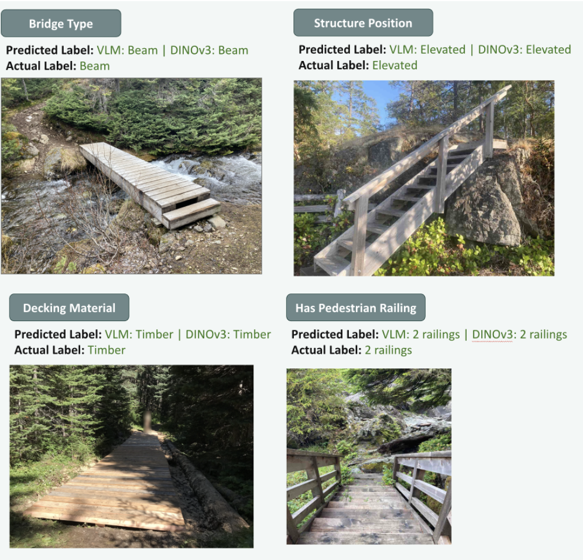
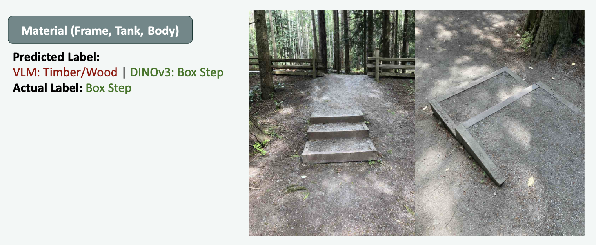

```{python}
#| include: false
import pandas as pd

master_df = pd.read_csv("../data/processed/master_dataset.csv")
file_exists = master_df["file_exists"]
if file_exists.dtype == object:
    image_file_count = int(
        file_exists.astype(str).str.lower().isin(["true", "1", "yes"]).sum()
    )
else:
    image_file_count = int(file_exists.fillna(False).sum())

images_per_asset = master_df.groupby("asset_id")["image_path"].nunique()
data_summary = pd.DataFrame(
    {
        "Measure": [
            "Image-asset rows",
            "Unique assets",
            "Rows with local image files",
            "Assets with more than one image",
            "Mean images per asset",
            "Median images per asset",
            "Maximum images for one asset",
        ],
        "Value": [
            f"{len(master_df):,}",
            f"{master_df['asset_id'].nunique():,}",
            f"{image_file_count:,}",
            f"{int((images_per_asset > 1).sum()):,} ({(images_per_asset > 1).mean():.1%})",
            f"{images_per_asset.mean():.2f}",
            f"{images_per_asset.median():.0f}",
            f"{images_per_asset.max():.0f}",
        ],
    }
)
asset_category_counts = (
    master_df["profile_name"]
    .value_counts()
    .rename_axis("Asset category")
    .reset_index(name="Image-asset rows")
)
asset_category_counts["Image-asset rows"] = asset_category_counts["Image-asset rows"].map(
    lambda value: f"{value:,}"
)

# --- Derived values for inline references in the prose ---
multi_image_assets = int((images_per_asset > 1).sum())
multi_image_share = (images_per_asset > 1).mean()
mean_images = images_per_asset.mean()
median_images = images_per_asset.median()
max_images = int(images_per_asset.max())

fall_height_fill = master_df["fall_height_bin"].notna().mean()
steps_fill = master_df["steps_bin"].notna().mean()
```

# Executive summary

BC Parks manages over 100,000 infrastructure assets, including stairs, trail bridges, boardwalks, viewing platforms, campsites, and related park facilities [@parry2026proposal]. Many asset records contain missing or incomplete attributes, which limits their value for maintenance planning, inspection prioritization, and replacement cost estimation. This project developed a reproducible image analysis pipeline that uses existing asset photographs to predict attribute labels. The default workflow screens images for privacy sensitive content, groups photos by asset, extracts DINOv3 image embeddings, and applies lightweight attribute specific logistic regression classifiers to produce predicted labels with confidence scores.

On the final held out test set, the default DINOv3 pipeline [@simeoni2025dinov3] achieved a mean weighted F1 score of 0.83 across 12 evaluated attributes. Performance was strongest for visually distinctive categorical attributes, including decking material, structure material, edge guard presence, pedestrian railing presence, and bridge type, with several scores above 0.90. Attributes related to measurements were harder to predict because photos often lack a reliable scale reference. Length and width were the weakest targets, reaching 0.66 and 0.63.

The final data product exports prediction tables for partners in both long and wide formats. Each prediction includes the asset identifier, asset category, predicted attribute value, confidence score, and confidence level.

Overall, we recommend using the current DINOv3 pipeline [@simeoni2025dinov3] as a decision support tool rather than a fully automated replacement for field review, with future work focused on improving model performance on measurement attributes and expanding to new asset categories.


# Introduction

BC Parks manages over 100,000 infrastructure records across provincial parks, including assets such as stairs, trail bridges, boardwalks, viewing platforms, campsites, and picnic facilities [@parry2026proposal]. Accurate information about these assets is essential for maintenance planning, replacement cost estimation, safety inspections, and long-term asset management. However, many records in the BC Parks asset inventory contain incomplete attribute information, limiting the ability of staff to confidently use the database for operational planning and decision-making. To maintain this inventory, field inspectors collect photos and record asset characteristics during site visits.  While these images capture valuable visual information about asset characteristics, many records still contain missing attributes due to incomplete field measurements, inconsistent data collection practices, or historical gaps in the inventory. Manually reviewing and labeling tens of thousands of images would require substantial staff time and is not feasible at scale. 

Recent advances in computer vision and vision language models create an opportunity to use these existing photographs to enrich the inventory [@volkov2025imagerecognitionvisionlanguage]. In collaboration with BC Parks, this project focused on three goals: predicting missing attributes, providing confidence scores alongisde attribute labels to flag for manual review, and building a modular workflow that can be extended to additional asset categories. Together, these objectives aim to improve the completeness and reliability of the BC Parks asset inventory while minimizing the need for manual data entry and review.

The dataset for this project contains images and attribute values for assets in `{python} f"{master_df['profile_name'].nunique()}"` infrastructure categories: stairs, trail bridges, low boardwalks, elevated boardwalks, and viewing platforms. Exploratory data analysis revealed several challenges, such as attribute class imbalances and inconsistent image quality and framing. To address these challenges, we developed a reproducible machine learning pipeline that generates structured asset attribute predictions from one or more photographs. Images first pass through a privacy-screening stage, where personally identifiable information (PII), such as faces, is detected and blurred. They are then transformed into numerical image embeddings and passed to a collection of lightweight, attribute-specific classifiers. The resulting predictions are combined with confidence scores and exported in a structured format that can be integrated into existing asset management workflows.

This report describes the development and evaluation of the proposed image-analysis pipeline. We first present key features of the BCParks dataset, followed by the modelling approaches investigated, their results and how this led us to the final design and implementation of our data pipeline for attribute labelling.

# Data and exploratory data analysis (EDA)

## Data sources and collection

BC Parks provided infrastructure asset records and attached image metadata from the CityWide asset management system. The export covers the asset families explored during this project: trail bridges, stairs, boardwalks, and viewing platforms. The raw data contains three linked components:

- Asset records: including asset identifier and asset category
- Asset attribute records: including materials, structural features, and measurements recorded by field staff
- Image attachment records and downloaded image files

The working dataset is organized around an image-asset attachment row. Each row contains an `asset_id`, image path, CityWide profile, file metadata, and the available attribute values for that asset. For modelling, however, the asset is the prediction unit: multiple images linked to the same asset are grouped together.

## Size and characteristics

The final processed master dataset contains `{python} f"{len(master_df):,}"` image-asset rows linked to `{python} f"{master_df['asset_id'].nunique():,}"` unique assets. Of these rows, `{python} f"{image_file_count:,}"` have corresponding local image files. The image coverage is uneven by asset type, with most rows belonging to boardwalks (lower than 1.2 meters) and trail bridges.

```{python}
#| label: tbl-data-summary
#| echo: false
#| tbl-cap: "Reproducible summary counts from `data/processed/master_dataset.csv`."
data_summary
```

```{python}
#| label: tbl-asset-category-counts
#| echo: false
#| tbl-cap: "Image-asset rows by CityWide asset category."
asset_category_counts
```


# Data science methods

## Approaches considered

Our exploratory analysis established that this is primarily a missing-attribute prediction problem on imbalanced and sparsely labelled data. Attribute coverage varies sharply across attributes: structural categories such as decking material and pedestrian-railing presence are relatively well populated, whereas measurement attributes are far sparser, with fall height labelled for only about `{python} f"{fall_height_fill:.1%}"` of rows and number of steps for about `{python} f"{steps_fill:.1%}"` (@fig-attribute-fill-rate). The categorical labels are also heavily imbalanced, with several material fields dominated by labels like 'Timber/Wood'.

To address BC Parks' main objective of automating attribute labelling with the limited labels we had, we decided to start with a simple no-training approach, using zero-shot vision language models (VLMs). We then explored whether pre-trained embedding models could better capture the fine-grained visual details that distinguish material types, pairing them with a simple classifier to output prediction labels for all attributes.

To establish a comparable benchmark, we implemented three baseline classifiers. Given the class imbalance present across some attributes, we included a majority class classifier that always predicts the most frequent category, a uniform random classifier that selects a label at random from all possible labels, and a stratified random classifier whose predictions reflect the observed class distribution.

## VLM Approach


{#fig-vlm-workflow width=90%}

We started with a zero-shot VLM approach which was motivated by the limited labelled data we had available (@fig-attribute-fill-rate), especially for measurement-based attributes. This was also important given that many of our ground-truth labels are themselves sometimes unreliable. Additionally, to reduce measurement error and becuase of the sparse and irregular numeric distributions in our labelled data (see @fig-numeric-distributions), we switched our numerical attributes from continuous to binned ranges, making them easier and simpler to infer from images.

{#fig-attribute-fill-rate width=90%}

{#fig-numeric-distributions width=90%}

There are several practical strengths that come with using VLMs for attribute predcition. It is non-technical to operate, the prompt is easy to configure, and it offers high flexibility where the prompt template can be adapted or expanded to additional asset types.

Its limitations are equally important to note. Running VLMs at scale can become costly if the free API tier does not meet demand, requiring the purchase of additional capacity to process enough images at once. Alternatively, the models can be run locally, but this demands computational resources BC Parks may not have. Also, there are privacy considerations when sending park imagery to an open source cloud service, which we mitigated by blurring people in images with YOLO before any cloud inference. Finally, validation is difficult for attributes such as length and width when ground-truth labels are limited and when there are rare classes within material-based attributes. For example, `Aluminum` was a very rare class in the `decking material` of trail bridges, so it was difficult to validate whether the VLM was actually performing poorly on this class (see @fig-bridge-rare-class).

{#fig-bridge-rare-class width=90%}

We compared attribute-specific prompts with a single multi-attribute prompt, and tested the two strongest available Google models: `gemma-4-26b` and `gemini-3-flash-preview`. We continued further prompt engineering and prediction labelling with both models since **gemma** was significantly cheaper and allowed for more requests per day (1500 assets labelled per day with the free-tier token) versus, the more expensive and slightly more accurate **gemini** model (20 assets labelled per day).


## Embedding-based classification

{#fig-emb-workflow width=90%}

The second modelling path treated each image as input to a pre-trained vision encoder and used the resulting embedding as a fixed feature representation. The motivation was practical: our labelled dataset is useful, but not large enough to train a high-capacity image model from scratch. Instead, we used foundation models that had already learned general visual representations from large-scale pretraining and trained lightweight classifiers on top of their embeddings.

First, images were loaded from the cleaned local image directory and passed through a frozen image encoder, meaning the model was not fine tuned or adjusted. Each image was converted into a numeric vector, image vectors were averaged to one embedding per asset, and one classifier was trained for each target attribute.

To ensure we explored multiple pre-trained embedding models, we evaluated three ditinct embedding models **DINOv3** [@simeoni2025dinov3], **SigLIP** [@zhai2023sigmoid] and **OpenCLIP** [@radford2021clip], comparing their performance.

For the classifier layer, we compared logistic regression, linear support vector machines, random forests, and histogram-based gradient boosting using scikit-learn [@pedregosa2011scikit].

## Results & Evaluation

We used **weighted F1** as the primary model-selection metric because the attribute labels are highly imbalanced (see @fig-categorical-distributions). A metric that only rewards the dominant class would overstate model quality for attributes where one material or one structural category appears much more often than the others. Weighted F1 balances precision (how often the model is correct when it predicts a particular label) and recall (how many of the assets that truly hold that label does the model actually recover), while weighing each class proportionally to how often it appears in the dataset. This makes it a better summary of performance on the distribution of labels BC Parks is most likely to encounter.

{#fig-categorical-distributions width=90%}

### Evaluations of VLM

The attribute-specific and multi-attribute VLM prompts produced consistently similar weighted F1 scores across stairs, trail bridges, and boardwalk attributes (@fig-stair-vlm-comparison, @fig-bridge-vlm-comparison, @fig-boardwalk-low-vlm-comparison). Because the multi-attribute prompt labels each asset once instead of once per attribute, it is the more practical option. The two models,`gemma-4-26b` and `gemini-3-flash-preview`, also performed similarly on weighted F1, with the exception of `gemini-3-flash-preview` occasionally performing better on fall height. Nonetheless, we retained both models because of **gemma**'s higher free-tier allowance, which makes it the practical choice at scale. 

{#fig-stair-vlm-comparison width=90%}

{#fig-bridge-vlm-comparison width=90%}

{#fig-boardwalk-low-vlm-comparison width=70%}


### Evaluations of Embedding models

We found that ogisitic regression was consistently competitive and often strongest, especially on binned numeric attributes seen in @fig-dinov3-classifiers. Since this was the simplest classifier, this suggested that the embedding space already separated many attribute classes well enough for a simple linear classifier to predict the labels. This result also supported a simpler final pipeline. More complex classifiers did not provide enough improvement to justify extra tuning or reduced interpretability. Logistic regression is fast to train, easy to rerun when new labels are added, and produces scores that can be converted into confidence levels for partner review.

{#fig-dinov3-classifiers width=100%}

Comparing the three embedding models with a fixed logistic-regression head, the mean weighted F1 across all twelve attributes was very similar for DINOv3,SigLIP, and OpenCLIP (@fig-emb-comparison).

{#fig-emb-comparison width=90%} 

{#fig-emb-comparison-per-attribute width=90%} 

Because the three embedding models performed comparably, our final choice was guided by practical deployment considerations rather than negligible accuracy differences. We selected DINOv3 as the most suitable embedding model because it occasionally outperformed the alternatives on the hardest attributes (see @fig-emb-comparison-per-attribute), it is the most lightweight to download and run locally at no extra cost, taking up approximately 0.3 GB of disk space, and its self-supervised features captured structural and material cues central to the infrastructure attributes. Running locally also avoids the per-request limits and ongoing costs associated with the cloud VLM approach, making DINOv3 the more sustainable option for processing BC Parks' image inventory at scale.

### Comparing the two approaches: VLM vs Embeddings

Comparing the two approaches directly (see @fig-vlm-vs-emb) revealed a consistent pattern. Both the VLM and the DINOv3 embedding classifier performed well on categorical, material-based attributes (0.7-0.97 weighted f1), with the exception of DINOv3 outperforming the VLM on the **material (frame, tank, body)** as shown in @fig-emb-boxstep and **fall height**. Both performed less well on the numeric attributes overall (0.3-0.6 weighted f1), even after these were binned into ordered categories.

{#fig-model-success width=90%}

{#fig-emb-boxstep width=90%}

Because performance was broadly comparable and due to the strengths noted above, DINOv3 was chosen as the default model.

{#fig-vlm-vs-emb width=100%}

### Evaluation of DINOv3 on the final held-out test dataset

{#fig-test-set-results width=100%}

@fig-test-set-results reports the final DINOv3 pipeline's weighted F1 on the held-out test set. The reference lines show the majority-class and uniform-random baselines computed on the same test assets, so the height of each bar above its baseline is the genuine value the model adds compared to random guessing or choosing the most common attribute label. 

As we expected, the results reflected the same divide seen consistently throughout the project and are comparable with our initial results above. The model performed best on visually distinctive categorical attributes: decking material reached 0.97, structure material, edge guard, structure position, and pedestrian railing reached 0.92 to 0.93, and bridge type reached 0.86. Abutment material and the stair specific material attribute (material - frame, tank, body) were lower at 0.72, likely because rare classes had fewer examples.

The measurement attributes performed better than we had expected given how little labelled data they have. Fall height and number of steps reached 0.84 and 0.81 respectively, while length and width were the hardest targets at 0.66 and 0.63, consistent with the difficulty of judging absolute dimensions from images without a scale or size reference.

# Data product

The primary deliverable of this project is a machine learning pipeline that predicts missing infrastructure attributes from photos of BC Parks assets. Rather than replacing existing asset management workflows, the data product is intended to augment them by generating attribute predictions and confidence scores that can be incorporated into existing review and data management processes.

{#fig-data-pipeline width=90%}

A key design requirement identified by BC Parks was modularity and flexibility. The organization manages many different infrastructure categories, each with distinct attribute requirements. For example, trail bridges require information about bridge type, decking material, and structure length, while stairs require information about number of steps and fall height. To accommodate these differences, we developed a modular pipeline that routes assets to category-specific prediction workflows and treats each attribute as an independent prediction task. This design allows individual models to be updated or replaced without affecting the rest of the system and makes it straightforward to extend the pipeline to new asset categories in the future.

Our default implementation using a logistic regression classifier to output attribute prediction labels from image embeddings generated with the pre-trained DINOv3 computer vision model. This was chosen due to its advantgeous deployment described in the methods section above. The pipeline still supports the ability to switch to the VLM approach if needed, allowing BC Parks staff to continue exploring prompt engineering with the provided prompt templates.

# Conclusions and recommendations

BC Parks maintains a large inventory of infrastructure assets that are not just limited to stairs, trail bridges, boardwalks and viewing platforms, many of which have incomplete labels. Verifying these attributes in the field is costly and slow, but is necessary to make decisions about safety, inspection scheduling, and resource allocation. Our product addressed this by predicting attribute labels given a set of asset images alongside corresponding confidence scores that may signal the need for manual intervention, which helps direct limited field-verification effort toward the predictions that most warrant a human check, whilst the more confident predictions rely on automated labelling.

The extent to which the product meets BC Parks' needs varies by attribute. For categorical attributes that are visually distinctive like decking material, structure material, and the presence of pedestrian railings, our pipeline provides labels that are dependable enough to reduce manual labelling meaningfully. For measurement-based attributes, the model will help but more manual review will be required. Based on our results, DINOv3 is the recommended default for large-scale processing.

## Strengths and limitations of current design

One of the major strengths of the pipeline is that both approaches rely on pre-trained foundation models. This was particularly important because the available labelled dataset was relatively small for many attributes. By leveraging representations learned from large external image datasets, both DINOv3 and the VLMs were able to achieve useful performance despite limited training data.

Since model performance varied by attribute type, we incorporated a confidence-based review workflow. This is especially important for the measurement-based attributes, where a DINOv3 classifier first generates an initial prediction and if it is accompanied by a low confidence score, it is easily identifiable for manual review. This strategy recognizes that fully automated predictions may not always be reliable for difficult attributes and instead focuses staff attention on cases with high uncertainty.

Despite these strengths, the current design has several limitations. Because the pipeline leverages models that have been trained on large general-purpose image datasets, they do not always transfer perfectly to the specialized infrastructure categories used by BC Parks. In addition, several attributes contained relatively few labelled examples, making both model training and performance evaluation less reliable. Rare classes that performed poorly were more prominently affected by this. These gaps, unreliable performance on rare and ambiguous attribute classes, and the difficulty of predicting measurement-based attributes, are ultimately data quality and task-design constraints that the pipeline itself cannot fully resolve.

## Future product improvements

Several opportunities exist for future improvement. Few-shot VLM prompting or DINOv3 fine-tuning could potentially improve performance by providing examples of BC Parks-specific infrastructure during training or inference. However, these approaches require substantially more labelled data and computational resources than were available during this project. Additional gains may also be achieved by incorporating open-source infrastructure image datasets to improve representation of rare classes and underrepresented asset types. Finally, future work could explore depth-estimation models for measurement-based attributes.

Overall, the resulting data product demonstrates that image-based machine learning can substantially improve the completeness of BC Parks' infrastructure records. A key insight from this work is that attribute difficulty depends less on model choice than on whether an attribute is visually determinable at all: visually distinctive attributes were learned well across multiple approaches, while measurement-based attributes remained challenging regardless of method.

# References
