```{python}
#| include: false
import pandas as pd

master_df = pd.read_csv("../data/processed/master_dataset.csv")
file_exists = master_df["file_exists"]
if file_exists.dtype == object:
    image_file_count = int(
        file_exists.astype(str).str.lower().isin(["true", "1", "yes"]).sum()
    )
else:
    image_file_count = int(file_exists.fillna(False).sum())

images_per_asset = master_df.groupby("asset_id")["image_path"].nunique()
data_summary = pd.DataFrame(
    {
        "Measure": [
            "Image-asset rows",
            "Unique assets",
            "Rows with local image files",
            "Assets with more than one image",
            "Mean images per asset",
            "Median images per asset",
            "Maximum images for one asset",
        ],
        "Value": [
            f"{len(master_df):,}",
            f"{master_df['asset_id'].nunique():,}",
            f"{image_file_count:,}",
            f"{int((images_per_asset > 1).sum()):,} ({(images_per_asset > 1).mean():.1%})",
            f"{images_per_asset.mean():.2f}",
            f"{images_per_asset.median():.0f}",
            f"{images_per_asset.max():.0f}",
        ],
    }
)
asset_category_counts = (
    master_df["profile_name"]
    .value_counts()
    .rename_axis("Asset category")
    .reset_index(name="Image-asset rows")
)
asset_category_counts["Image-asset rows"] = asset_category_counts["Image-asset rows"].map(
    lambda value: f"{value:,}"
)

# --- Derived values for inline references in the prose ---
multi_image_assets = int((images_per_asset > 1).sum())
multi_image_share = (images_per_asset > 1).mean()
mean_images = images_per_asset.mean()
median_images = images_per_asset.median()
max_images = int(images_per_asset.max())

fall_height_fill = master_df["fall_height_bin"].notna().mean()
steps_fill = master_df["steps_bin"].notna().mean()
```

# Executive summary

[to be completed after running pipeline with test set + obtaining results] **pending completion**


# Introduction

BC Parks manages over 100,000 infrastructure records across provincial parks, including assets such as stairs, trail bridges, boardwalks, viewing platforms, campsites, and picnic facilities [@parry2026proposal]. Accurate information about these assets is essential for maintenance planning, replacement cost estimation, safety inspections, and long-term asset management. Infrastructure characteristics such as material type, dimensions, and structural features are used to determine maintenance requirements and whether an asset requires inspection by a qualified professional. However, many records in the BC Parks asset inventory contain incomplete attribute information, limiting the ability of staff to confidently use the database for operational planning and decision-making.

To maintain this inventory, field inspectors collect photos and record asset characteristics during site visits. As a result, BC Parks has accumulated a large repository of infrastructure images, with approximately 50,000 asset records containing one or more photographs [@parry2026proposal]. While these images capture valuable visual information about asset characteristics, many records still contain missing attributes due to incomplete field measurements, inconsistent data collection practices, or historical gaps in the inventory. Manually reviewing and labeling tens of thousands of images would require substantial staff time and is not feasible at scale. Consequently, incomplete records persist, limiting its value as a decision-support tool.

Recent advances in computer vision and vision-language models (VLMs) have demonstrated strong capabilities for extracting structured information from images, creating an opportunity to enrich infrastructure records using existing image-based data [@volkov2025imagerecognitionvisionlanguage]. In collaboration with BC Parks, the broad objective of applying image analysis to infrastructure photographs was refined into three specific goals: (1) automate the prediction of missing asset attributes from photographs, (2) provide a confidence score for every prediction so that uncertain predictions can be flagged for manual review, and (3) develop a modular workflow that can be extended to additional asset categories in the future, such as picnic tables, campsites, and tent pads. Together, these objectives aim to improve the completeness and reliability of the BC Parks asset inventory while minimizing the need for manual data entry and review.

The dataset for this project contains images and attribute values for assets in `{python} f"{master_df['profile_name'].nunique()}"` infrastructure categories: stairs, trail bridges, low boardwalks, elevated boardwalks, and viewing platforms. Exploratory data analysis revealed several challenges, such as attribute class imbalances and inconsistent image quality and framing. To address these challenges, we developed a reproducible machine learning pipeline that generates structured asset attribute predictions from one or more photographs. Images first pass through a privacy-screening stage, where personally identifiable information (PII), such as faces, is detected and blurred. The cleaned images are then transformed into numerical image embeddings and passed to a collection of lightweight, attribute-specific classifiers. In addition to the primary embedding-based approach, the pipeline supports optional attribute prediction using open-source vision-language models (VLMs) accessed through external APIs. The resulting predictions are combined with confidence scores and exported in a structured format that can be integrated into existing asset management workflows.

Across the evaluated asset categories, the pipeline achieved strong performance on structural attributes such as bridge type, decking material, and pedestrian railing presence, with a mean weighted F1-score of 0.88. Performance was lower for measurement-related attributes such as length, width, number of steps, and fall height, which achieved a mean weighted F1-score of 0.62. These results demonstrate the potential for image-based machine learning to improve the completeness and usability of BC Parks' infrastructure inventory while providing a scalable foundation for future expansion to additional asset types.

This report describes the development and evaluation of the proposed image-analysis pipeline. We first present key features of the BCParks dataset, followed by the modelling approaches investigated, their results and how this led us to the final design and implementation of our data pipeline for attribute labelling.


# Data and exploratory data analysis (EDA)

## Data sources and collection

BC Parks provided infrastructure asset records and attached image metadata from the CityWide asset management system. The export covers the asset families explored during this project: trail bridges, stairs, boardwalks, and viewing platforms. The raw data contains three linked components:

- Asset records: including asset identifier and asset category
- Asset attribute records: including materials, structural features, and measurements recorded by field staff
- Image attachment records and downloaded image files

The working dataset is organized around an image-asset attachment row. Each row contains an `asset_id`, image path, CityWide profile, file metadata, and the available attribute values for that asset. For modelling, however, the asset is the prediction unit: multiple images linked to the same asset are grouped together so one asset does not appear in both training and validation folds.

## Size and characteristics

The final processed master dataset contains `{python} f"{len(master_df):,}"` image-asset rows linked to `{python} f"{master_df['asset_id'].nunique():,}"` unique assets. Of these rows, `{python} f"{image_file_count:,}"` have corresponding local image files. The image coverage is uneven by asset type, with most rows belonging to boardwalks (lower than 1.2 meters) and trail bridges.

```{python}
#| label: tbl-data-summary
#| echo: false
#| tbl-cap: "Reproducible summary counts from `data/processed/master_dataset.csv`."
data_summary
```

```{python}
#| label: tbl-asset-category-counts
#| echo: false
#| tbl-cap: "Image-asset rows by CityWide asset category."
asset_category_counts
```

Most assets have a single image, but `{python} f"{multi_image_assets:,}"` assets, or `{python} f"{multi_image_share:.1%}"` of assets, have more than one image. The mean number of images per asset is `{python} f"{mean_images:.2f}"`, the median is `{python} f"{median_images:.0f}"`, and the largest asset has `{python} f"{max_images}"` images. This is useful because multiple viewpoints can reveal different details, but it also makes grouped evaluation essential.

# Data science methods

## Approaches considered

Our exploratory analysis established that this is primarily a missing-attribute prediction problem on imbalanced and sparsely labelled data. Attribute coverage varies sharply across attributes: structural categories such as decking material and pedestrian-railing presence are relatively well populated, whereas measurement attributes are far sparser, with fall height labelled for only about `{python} f"{fall_height_fill:.1%}"` of rows and number of steps for about `{python} f"{steps_fill:.1%}"` (@fig-attribute-fill-rate). The categorical labels are also heavily imbalanced, with several material fields dominated by timber. Lastly, many assets possess multiple images of varying quality, and not every record has a usable local image. Together, the scarcity of labels, the class imbalance, and the multi-image structure of the data motivated the approaches, the evaluation metric, and the preprocessing decisions carried out in order to build our final data pipeline.

To address BCPark's main objective, automating attribute labelling and filling in missing attribute labels where possible, we started with a simple no-training-required approach, using zero-shot vision language models. We then explored whether pretrained embedding models, trained on billions of images, could better capture the fine-grained visual details that distinguish material types, pairing them with a simple classifier to label all attributes from our images. We anticipated that embedding models, by capturing visual similarity through vector representations, might outperform VLM reasoning for structurally distinct material types, but would likely not differ for the numeric, measurement based attributes.

To establish a comparable benchmark, we implemented three baseline classifiers. Given the class imbalance present across some attributes, we included a majority class ("dummy") classifier that always predicts the most frequent category, alongside a uniform random classifier that selects a label at random from all possible labels, and a stratified random classifier whose predictions reflect the observed class distribution.

## VLM Approach


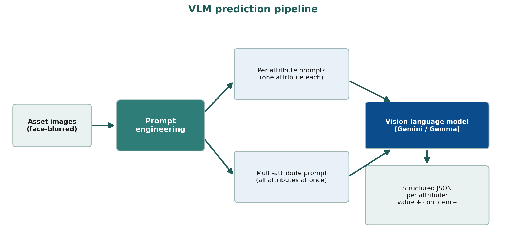{#fig-vlm-workflow width=90%}

We chose a zero-shot vision-language model approach because it requires no training, which suited our very limited labelled data, particularly for the measurement-based numeric attributes, where labelled examples are scarcest (see the attribute fill rates in @fig-attribute-fill-rate). Approaches that require training a model from scratch were not feasible given the size of our dataset, and were further complicated by the fact that many of our ground-truth labels are themselves unreliable. Additionally, to reduce measurement error and becuase of the sparse and irregular numeric distributions in our labelled data (see @fig-numeric-distributions), we switched our numerical attributes from continuous to binned ranges, making them easier and simpler to infer from images. Since we also had multiple images, of varying quality, per asset, it made sense to pass all images and have the VLM evaluate labels based on all angles of the asset images. A zero-shot VLM was therefore most our most suitable starting point.

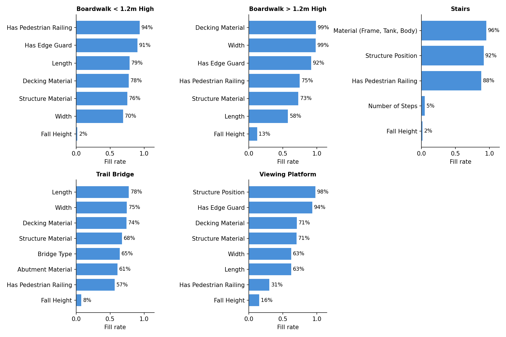{#fig-attribute-fill-rate width=90%}

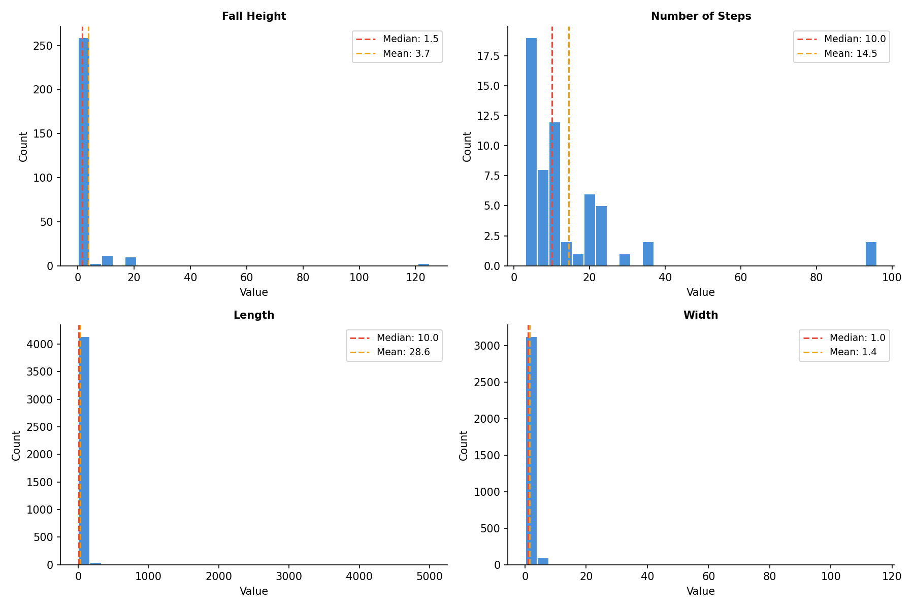{#fig-numeric-distributions width=90%}

There are several practical strengths that come with using VLMs for attribute predcition. It is non-technical to operate, the prompt is easy to configure, and it offers high flexibility where the prompt template can be adapted or expanded to additional asset types if BC Parks chooses to extend its system beyond the 5 assets we validated. 

Its limitations are equally important to note. Running VLMs at scale can become costly if the free API tier does not meet demand, requiring the purchase of additional capacity to process enough images at once. Alternatively, the models can be run locally, but this demands computational resources BC Parks may not have. Also, there are privacy considerations when sending park imagery to an open source cloud service like `gemini-flash-preview`, which we mitigated by blurring people in images with YOLO before any cloud inference. Finally, validation is difficult for attributes such as length and width when ground-truth labels are limited and when there are rare classes within material-based attributes. For example, `Aluminum` was a very rare class in the `decking material` of trail bridges, so it was difficult to validate whether the VLM was actually performing poorly or if it could capture this material with more labelled data. The same was seen for the `Aluminium Sill Fil` category of the `abutment material` attribute. See @fig-bridge-rare-class

{#fig-bridge-rare-class width=90%}

For prompt design, we compared attribute-specific prompts against a single multi-attribute prompt that requests all of an asset's attributes at once, to assess whether different prompting methods impacted label quality. Moreover, we explored a variety of different VLM models intiially (OpenAI, Llama models, Phi-Multimodal image models and Google AI models), but narrowed it down to the best performing models from the Google AI model bundles, `gemma-4-26-b` vs `gemini-flash-preview`. We continued further prompt engineering and prediction labelling with both models since Gemma was significantly cheaper and allowed for more requests per day (1500 assets labelled a day with free-tier token) versus, the more expensive and slightly more accurate **gemini** model (maximum of 20 assets labelled per day), to also weigh a cost-accuray tradeoff.

The stakeholders most affected by these predictions are BC Parks' asset-management team, who use the resulting labels to decide when and whether to dispatch field engineers for periodic inspection and repair. This raises a clear ethical consideration: an inaccurate prediction risks a high-risk asset being overlooked. The pipeline therefore attaches a confidence score to every prediction and flags low-confidence cases for manual review, which is especially important for high-priority attributes such as length and fall height.


## Embedding-based classification

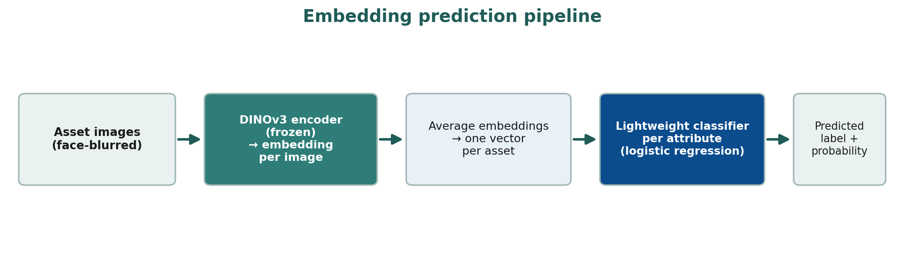{#fig-emb-workflow width=90%}

The second modelling path treated each image as input to a pre-trained vision encoder and used the resulting embedding as a fixed feature representation. The motivation was practical: our labelled dataset is useful, but not large enough to train a high-capacity image model from scratch. Instead, we used foundation models that had already learned general visual representations from large-scale pretraining and trained lightweight classifiers on top of their embeddings. This gave us a supervised image-based approach while keeping the number of trainable parameters small and the experiments reproducible.

First, images were loaded from the cleaned local image directory and passed through a frozen image
encoder. Each photo was converted into a dense numeric vector. Because many BC Parks assets have multiple photos, we then averaged the image-level vectors for the same `asset_id` to create one asset-level embedding. This asset-level table was joined to the attribute-specific training labels, and one classifier was trained per target attribute. This design avoided duplicating labels across multiple photos while still allowing all available visual evidence for an asset to contribute to the final representation.

To ensure we explored multiple pre-trained embedding models, we evaluated three ditinct models and compared their performance:

- **DINOv3**: a self-supervised vision transformer trained to produce general visual features without relying on image-text labels [@simeoni2025dinov3]. We used DINOv3 as the main representation learner because self-supervised visual features are often strong for object shape, structure, texture, and material cues, all of which are central to infrastructure attributes.
- **SigLIP**: a vision-language model trained with a sigmoid image-text pretraining loss [@zhai2023sigmoid]. We used only the vision encoder, not the text encoder. The reason for including SigLIP was that language-aligned
pretraining can sometimes encode higher-level semantic scene information that is useful for attributes such as structure position or decking material.
- **OpenCLIP / CLIP-style embeddings**: a contrastive image-text baseline based on the CLIP family of models [@radford2021clip]. This provided an additional comparison point for language-aligned embeddings.

For the classifier layer, we tested logistic regression, linear support vector machines, random forests, and histogram-based gradient boosting using scikit-learn [@pedregosa2011scikit], all different classifiers of varying sizes, to ensure we exhausted many classifiers and leveraged the best performing model (see Results & Evaluation section). 

## Results & Evaluation

We used **weighted F1** as the primary model-selection metric because the attribute labels are highly imbalanced (see @fig-categorical-distributions). A metric that only rewards the dominant class would overstate model quality for attributes where one material or one structural category appears much more often than the others. Weighted F1 balances precision (how often the model is correct when it predicts a particular label) and recall (how many of the assets that truly hold that label does the model actually recover), while weighting each class by its support, making it a better summary of performance on the distribution of labels BC Parks is most likely to encounter.

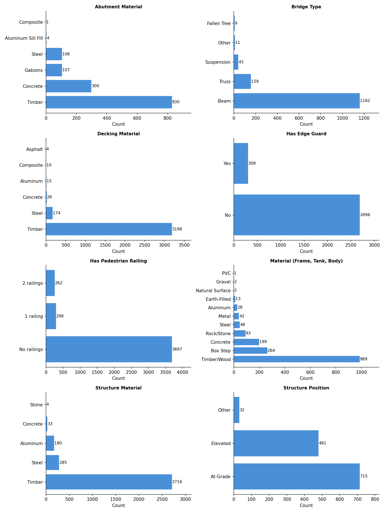{#fig-categorical-distributions width=90%}

### Evaluations of VLM

We evaluated the two prompt designs and the two candidate models together on each asset type's attributes. Across stairs, trail bridges, and boardwalks, the attribute-specific and multi-attribute prompts produced weighted-F1 scores that were close on nearly every attribute (@fig-stair-vlm-comparison, @fig-bridge-vlm-comparison, @fig-boardwalk-low-vlm-comparison), indicating that asking for all of an asset's attributes in a single prompt did not reduce the label quality relative to asking for each attribute separately. Because the multi-attribute prompt sends each asset to the model only once rather than once per attribute, it is more cost-effective to implement, so we adopted it for our VLM portion of the pipeline. The two models,`gemma-4-26b` and `gemini-3-flash-preview`, also performed similarly on weighted F1, with the exception of `gemini-3-flash-preview` occassionally performing better on **fall height**. Nonetheless, we retained both because of Gemma's far higher free-tier allowance(roughly 1,500 assets per day, versus about 20 for Gemini), which makes it the
practical choice at scale.

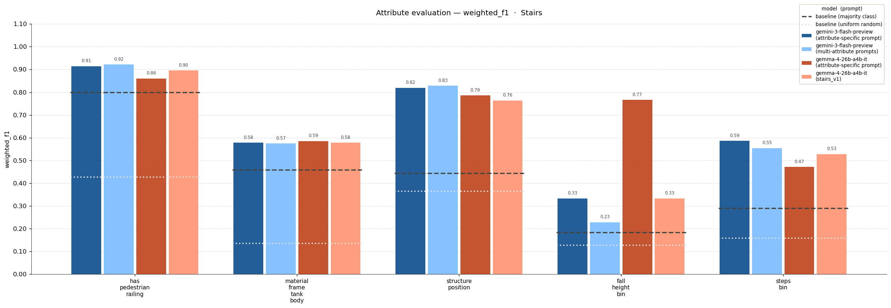{#fig-stair-vlm-comparison width=90%}

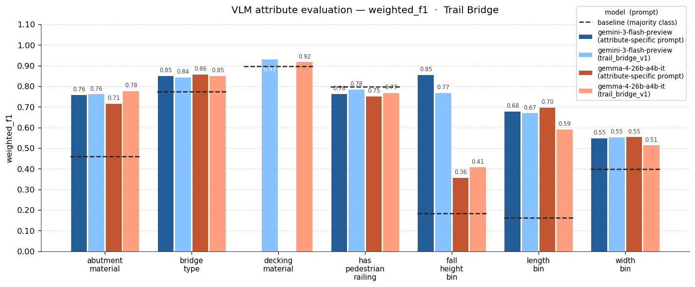{#fig-bridge-vlm-comparison width=90%}

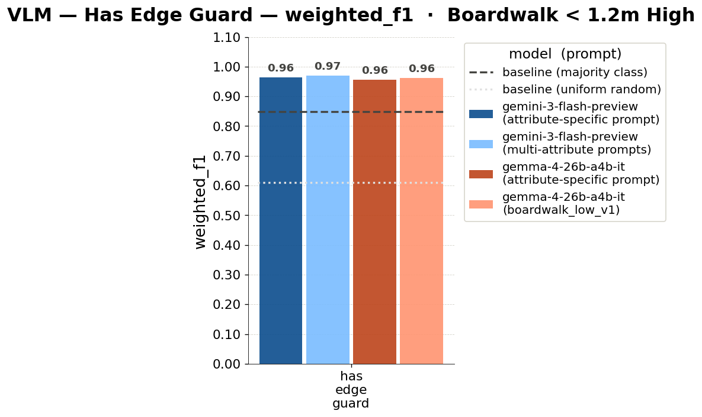{#fig-boardwalk-low-vlm-comparison width=70%}


### Evaluations of Embedding models

We found that classifiers performed similarly but logisitic regression occassionally outperformed the rest, especially on numeric attributes (see @fig-dinov3-classifiers). Since this was the simplest classifier, it indicated that the embedding space already separates the attribute classes reasonably well, and so a simple linear classifier like logisitic regression was adequate for classification purposes. We also tested a tuned logistic-regression variant by searching over regularization strength and class weighting inside the training folds. In practice, the tuned variant did not consistently improve over the simpler default logistic-regression setup, so the untuned logistic model remained the main embedding classifier.

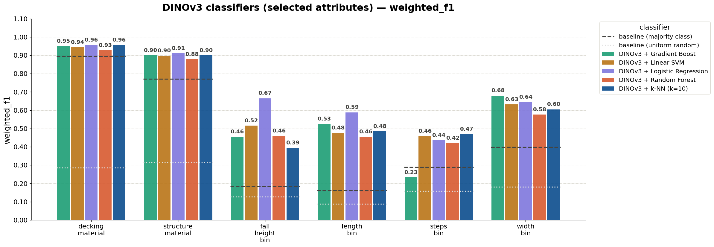{#fig-dinov3-classifiers width=100%}

Comparing the three embedding models with a fixed logistic-regression head, the mean weighted F1 across all twelve attributes was very similar for DINOv3,SigLIP, and OpenCLIP (@fig-emb-comparison).

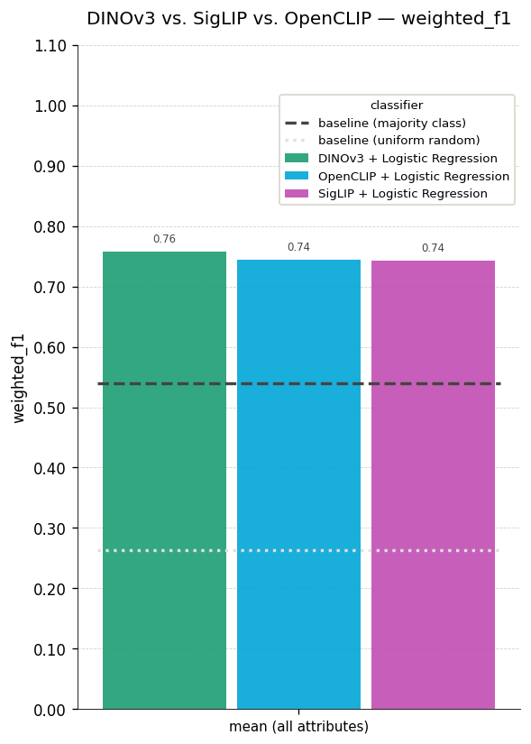{#fig-emb-comparison width=90%} 

The per-attribute view (@fig-emb-comparison-per-attribute) shows example of where small differences emerge. DINOv3 occasionally edged ahead on the harder attributes, including fall height, though these are the attributes with the fewest labels, so the advantage should be read cautiously rather than as a decisive result.

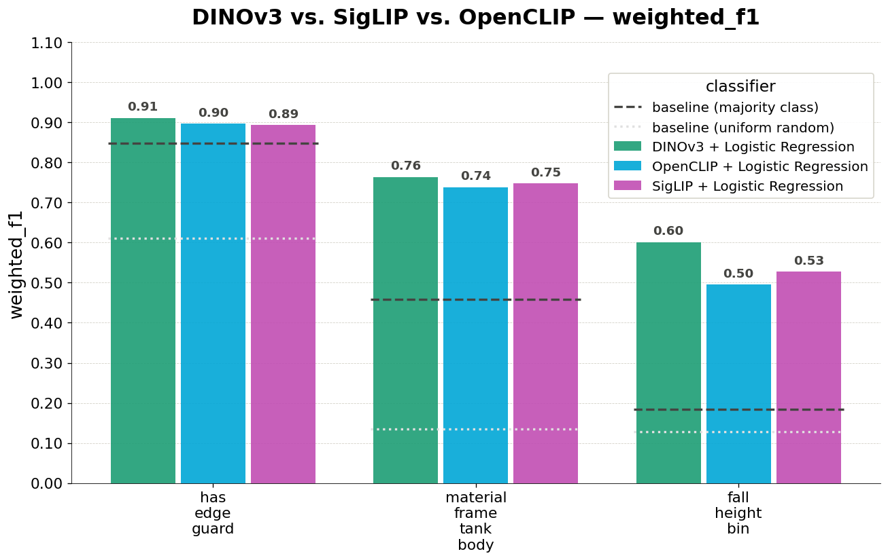{#fig-emb-comparison-per-attribute width=90%} 

Because the three embedding models performed comparably, our final choice was guided by practical deployment considerations rather than negligible accuracy differences. We selected DINOv3 as the most suitable embedding model because it occasionally outperformed the alternatives on the hardest attributes (see @fig-emb-comparison-per-attribute), it is more lightweight to download and run locally at no extra cost, taking up approximately 0.3 GB of disk space, and its self-supervised features captured structural and material cues central to the infrastructure attributes. Running locally also avoids the per-request limits and ongoing costs associated with the cloud VLM approach, making DINOv3 the more sustainable option for processing BC Parks' image inventory at scale.

### Comparing the two approaches: VLM vs Embeddings

Comparing the two approaches directly (see @fig-vlm-vs-emb) revealed a consistent pattern. Both the VLM and the DINOv3 embedding classifier performed well on categorical, material-based attributes, with the exception of DINOv3 outperforming the VLM on the material (frame, tank, body) attribute specific to the stair asset and fall height. Both performed less well on the numeric attributes overall, even after these were binned into ordered categories.

Because performance was broadly comparable and due to the strengths noted above, DINOv3 was chosen as the default model. Evaluation scores on numeric based attributes were less reliable due to the limited labelled data we had for validation, however, since the VLM did occassionally outperform the embedding model on attributes like number of steps and abutment material, we kept the option for VLM use available, if BCParks wishes to explore that approach further. This was optionally configured into our pipeline and can replace DINOv3 labelling.

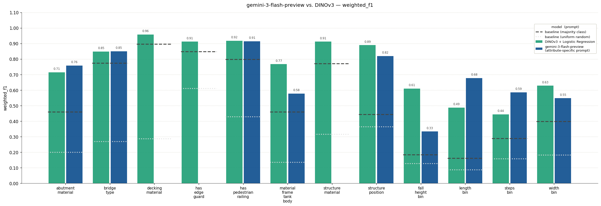{#fig-vlm-vs-emb width=100%}

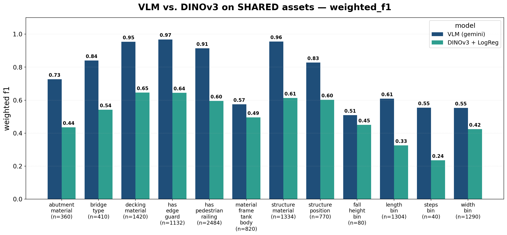{#fig-vlm-vs-emb-matched width=90%}**need to regenerate with baselines

### Evaluation of DINOv3 on the final held-out test dataset

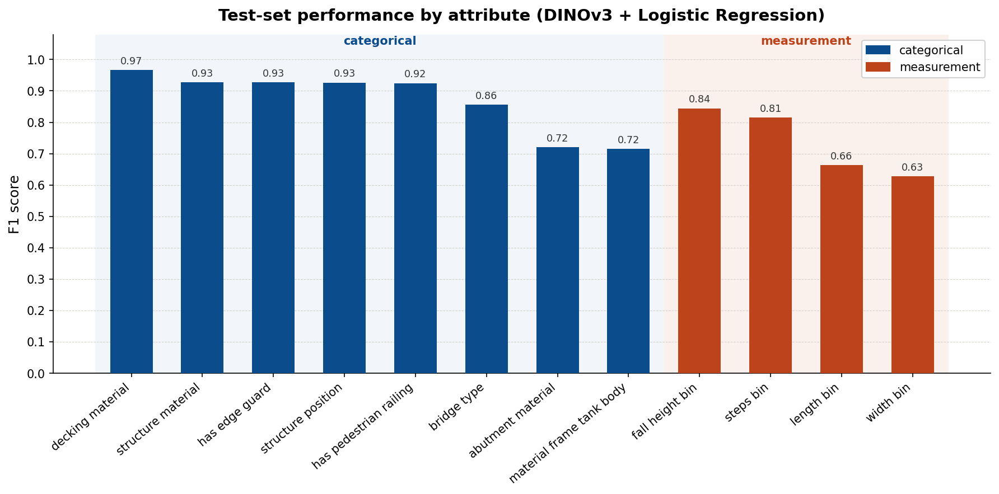{#fig-test-set-results width=100%}

@fig-test-set-results reports the final DINOv3 pipeline's weighted F1 on the held-out test set, the data the classifiers never saw during training, and so represents our most honest estimate of deployment performance. The reference lines show the majority-class and uniform-random baselines computed on the same test assets, so the height of each bar above its baseline is the genuine value the model adds compared to random guessing or choosing the most common attribute label. 

As we expected, the results reflected the same divide seen consistently throughout the project. The categorical, visually-distinctive attributes are predicted well: decking material reaches 0.97, and structure material, edge-guard presence, structure position, and pedestrian-railing presence all sit between 0.92 and 0.93. Bridge type follows at 0.86. The two weakest categoricals, abutment material and the stair-specific material (frame, tank, body) attribute, both reach 0.72. These are among the categories most affected by the rare-class scarcity discussed earlier, which may explain their reduced performance scores.

The measurement attributes performed better than we had expected given how little labelled data they have. Fall height and number of steps reached 0.84 and 0.81 respectively while length and width were the hardest targets at 0.66 and 0.63, consistent with the difficulty of judging absolute dimensions from images without a scale or size reference.

These results support the conclusion that an attribute's difficulty depends far more on whether it is visually determinable from the available photographs than on which model is used to predict it. Visually distinctive attributes were learned well, while attributes that require estimating physical scale remained the hardest
regardless of approach, a key takeaway that directly shaped the confidence-based review workflow described in our data pipeline expalanation below.

# Data product

The primary deliverable of this project is a machine learning pipeline that predicts missing infrastructure attributes from photos of BC Parks assets. The pipeline was designed to help BC Parks improve the completeness of its asset inventory without requiring staff to manually review and label thousands of photographs. Rather than replacing existing asset management workflows, the data product is intended to augment them by generating attribute predictions and confidence scores that can be incorporated into existing review and data management processes.

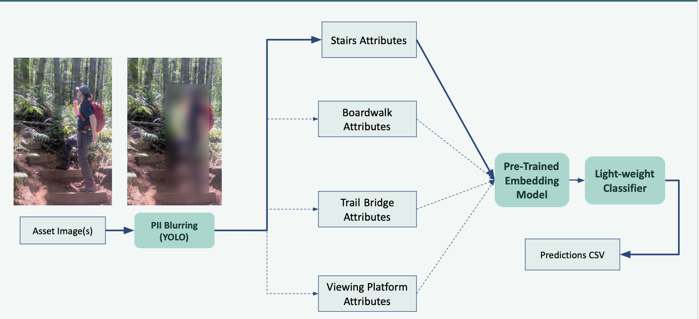{#fig-data-pipeline width=90%}

A key design requirement identified by BC Parks was modularity and flexibility. The organization manages many different infrastructure categories, each with distinct attribute requirements. For example, trail bridges require information about bridge type, decking material, and structure length, while stairs require information about number of steps and fall height. To accommodate these differences, we developed a modular pipeline that routes assets to category-specific prediction workflows and treats each attribute as an independent prediction task. This design allows individual models to be updated or replaced without affecting the rest of the system and makes it straightforward to extend the pipeline to new asset categories in the future.

Our default implementation involves running the (DINOv3) embedding model where image embeddings are generated by the pre-trained DINOv3 computer vision model combined with lightweight logistic regression classifiers. This was chosen due to its high performing f1 socres, the ability to run the modal locally with no cost and its manageable computational requirements. However, the pipeline still supports the ability to switch between both approaches if needed. Using the optional argument adjustment, BCParks can switch to the use of vision-language models (VLMs), and continue exploring with the provided prompt templates. In practice, BC Parks can choose between a simple, low-cost deployment that relies entirely on DINOv3-based classifiers or a VLM-based approach.

# Conclusions and recommendations

BC Parks maintains a large inventory of infrastructure assets that are not just limited to stairs, trail bridges, boardwalks and viewing platforms, and for which many have incomplete labels. Verifying these attributes in the field is costly and slow, but is necessary to make decisions about safety, inspection scheduling, and resource allocation. The original problem was therefore whether these missing attributes could be predicted directly from existing asset photographs, reducing the manual effort required to keep records complete and shiftng to a more automated attribute-labelling-pipeline, so that manual resources can be allocated elsewhere. Our product addressed this by predicting attribute labels given a set of asset images alongside corresponding confidence scores that may signal the need for manual intervention, which helps direct limited field-verification effort toward the predictions that most warrant a human check, whilst the more confident predictions rely on automated labelling.

The extent to which the product meets BC Parks' needs varies by attribute. For categorical attributes that are visually distinctive like decking material, structure material, and the presence of pedestrian railings, our pipeline provides labels that are dependable enough to reduce manual labelling meaningfully. Measurement-based attributes such as length, width, fall height and number of steps are considerably harder. Here, the model will help but more manual review will be required, rather than fully relying on automated labelling from our pipeline.The accompanying confidence score will also help prioritize which assets need manual intervention. Based on our results, DINOv3 is the recommended default for large-scale processing. The VLM and its corresponding prompt templates are also provided, and BC Parks can optionally incorporate them for assets where higher accuracy justifies the additional cost.

## Strengths and limitations of current design

One of the major strengths of the pipeline is that both approaches rely on pre-trained foundation models. This was particularly important because the available labelled dataset was relatively small for many attributes. By leveraging representations learned from large external image datasets, both DINOv3 and the VLMs were able to achieve useful performance despite limited training data. The DINOv3-based workflow also provides significant operational advantages. The model is lightweight (approximately 0.3 GB), can be downloaded and executed locally at no cost, and generates predictions rapidly. This makes it particularly well suited for large-scale processing of BC Parks' image inventory.

Since model performance varied by attribute type, we incorporated a confidence-based review workflow. This is especially important for the measurement-based attributes, where a DINOv3 classifier first generates an initial prediction and if it is accompanied by a low confidence score, it is easily identifiable for manual review. This strategy recognizes that fully automated predictions may not always be reliable for difficult attributes and instead focuses staff attention on cases with high uncertainty.

Despite these strengths, the current design has several limitations. Because the pipeline leverages models that have been trained on large general-purpose image datasets, they do not always transfer perfectly to the specialized infrastructure categories used by BC Parks. In addition, several attributes contained relatively few labelled examples, making both model training and performance evaluation less reliable. Rare classes that performed poorly were more prominently affected by this, where it was difficult to determine whether poor performance reflects a true limitation of the model or simply insufficient evaluation data. These gaps, unreliable performance on rare and ambiguous attribute classes, and the difficulty of predicting measurement-based attributes, are ultimately data quality and task-design constraints that the pipeline itself cannot fully resolve.

Another limitation is the reliance on external VLM APIs. While large models such as Gemini 3 Flash Preview often achieved stronger predictive performance than smaller alternatives, they are subject to usage limits and operational costs. These constraints can become significant when processing large image collections. These constraints make it difficult to use high-performing VLMs alone for large-scale processing and further justify defaulting to a local embedding-based model and classifier in our pipeline.

## Future product improvements

Several opportunities exist for future improvement. Few-shot VLM prompting or DINOv3 fine-tuning could potentially improve performance by providing examples of BC Parks-specific infrastructure during training or inference. However, these approaches require substantially more labelled data and computational resources than were available during this project. Additional gains may also be achieved by incorporating open-source infrastructure image datasets to improve representation of rare classes and underrepresented asset types. Finally, future work could explore depth-estimation models for measurement-based attributes. Because many of the weakest-performing attributes require estimating physical dimensions from two-dimensional images, incorporating geometric information may provide a more principled solution than image classification alone.

Overall, the resulting data product demonstrates that image-based machine learning can substantially improve the completeness of BC Parks' infrastructure records. A key insight from this work is that attribute difficulty depends less on model choice than on whether an attribute is visually determinable at all: visually distinctive attributes were learned well across multiple approaches, while measurement-based attributes remained challenging regardless of method. This shifted our thinking away from "which model is best" toward "which attributes can be automated reliably, and which require a human in the loop", a framing that shaped both the pipeline design and the confidence-based review workflow. The result is a scalable, cost-effective, and extensible framework that can continue to evolve as additional data and asset categories become available.

# References
